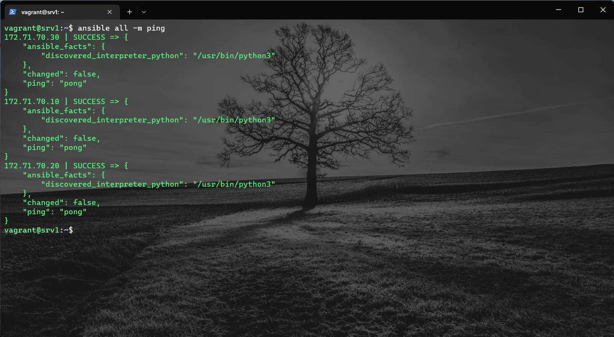
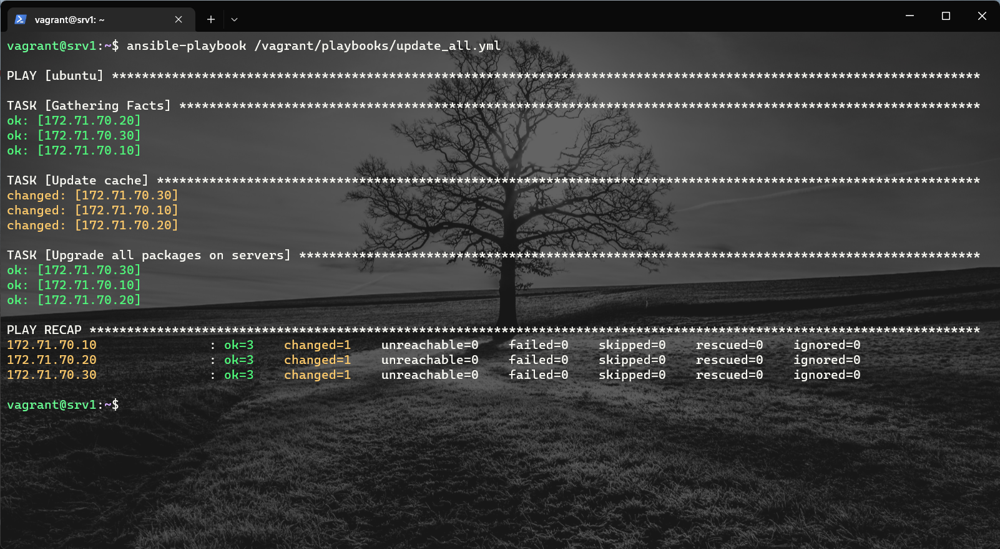

# Ansible Getting Started

[Ansible®](https://www.ansible.com/) é uma ferramenta open source para automação de TI que automatiza processos de provisionamento, gerenciamento de configurações, implantação de aplicações, orquestração e muitos outros processos manuais de TI. Em comparação com ferramentas de gerenciamento mais simples, usuários do Ansible (administradores de sistema, desenvolvedores e arquitetos) podem usar as regras de automação do Ansible para instalar softwares, automatizar tarefas rotineiras, provisionar infraestrutura, melhorar a segurança, a conformidade e aplicar patches em sistemas.

## Importante
Este repositório encontra-se arquivado e, consequentemente, não está mais sob manutenção ou recebendo atualizações. Foi originalmente desenvolvido com o objetivo de explorar a implementação prática de um sistema de gerenciamento de parque computacional, utilizando a ferramenta Ansible. Dada a natureza educativa e experimental do projeto, ele cumpriu seu propósito inicial. Portanto, considero não existir mais necessidade de mantê-lo ativo, uma vez que não planejo realizar futuras atualizações ou modificações.

Lembre-se de que, embora o repositório não esteja mais ativo, ele ainda pode servir como uma valiosa fonte de referência para projetos e estudos similares.

## Inventário

O Ansible foi projetado para trabalhar com múltiplos sistemas (servidores baremetal, máquinas virtuais, dispositivos de rede, e etc.) ao mesmo tempo. Ele trabalha selecionando partes desses sistemas listados num arquivo de inventário, que por padrão fica salvo em `/etc/ansible/hosts`. É possível também especificar um arquivo diferente usando o parâmetro `-i <path/nomeinventario>` na linha de comando (Ad-Hoc `$ansible` ou Playbook `$ansible-playbook`).

```
[ubuntu]
172.71.70.10
172.71.70.20
172.71.70.30

[ubuntu:vars]
ansible_user=vagrant
ansible_ssh_private_key_file=/home/vagrant/.ssh/ansible_lab
ansible_become=yes
ansible_become_method=sudo

[lab]
172.71.70.10
172.71.70.20
172.71.70.30

[apache]
172.71.70.20
```

Verificando se todos os hosts (all) do inventário estão respondendo `ansible all -m ping`:


## Playbooks
Os comandos Ad-Hoc executam apenas um módulo por vez. Mas e se a gente quiser criar uma sequência de tarefas com os módulos disponíveis? Aí que entram as playbooks.

Utilizando um arquivo no formato [YAML](https://yaml.org/), todas as tarefas podem ser definidas em sequência e chamadas através de um único comando `ansible-playbook -i <nome_inventario> <nome_playbook>`.

```yml
- hosts: ubuntu
  tasks:
    - name: Update cache
      apt:
       update_cache: yes

    - name: Upgrade all packages on servers
      apt:
        name: "*"
        state: latest
```

Executando o comando `sudo apt update` em todas as máquinas:


## Autor

Feito com :heart: por [Alexsander Lopes Camargos](https://github.com/alexcamargos) :wave: Entre em contato!

[](https://github.com/alexcamargos)
[](https://twitter.com/alcamargos)
[](https://www.linkedin.com/in/alexcamargos/)
[](mailto:alcamargos@vivaldi.net)

## Copyright

Copyright 2022 by Alexsander Lopes Camargos.

## License

[MIT License](LICENSE)
